# README

# Artistree
### Artistree aims to connect artists and customers through specific jobs. 
### Customers can browse artists' portfolios, or search them by the specifications they are looking for.
### Artists can use Artistree as a portfolio site, and as a way to connect with potential customers interested in their specific style.

# Website URL
- https://sleepy-bayou-35902.herokuapp.com/
# Github URL
- https://github.com/JakePitman/artistree-extended
# dbdesigner URL
- https://www.dbdesigner.net/designer/schema/167734
# Figma URL
- https://www.figma.com/file/PGyq9MdjaHLUe2MV9QSwUmFg/Artistree
# Trello URL
- https://trello.com/b/Hj3I50qJ/artistree

## Please note that the project folder I am handing in was cloned from the completed mvp, to be extended upon. The website url and github (with commits) to the mvp are below:
- https://evening-savannah-50694.herokuapp.com
- https://github.com/JakePitman/artistree
_________________________________________________

## Problems and Solutions

### Would-be art-buyers are unlikely to find art that matches what they are specifically looking for
- Artistree allows customers to search for artists by style
- Customers can then send a 'request' to the artist(s) of their choosing, with more detail such as
    - materials
    - acceptable sizes
    - desired colour palette
    - the content of the art
### Artists need customers
- Instead of creating art and hoping that someone will like it, artists can take specific jobs and tailor their art accordingly
### Artists need to get their art out there!
- Artistree can double as a nice portfolio of artists' work
- Artists will need to upload examples of their work so that buyers can see their style
- Each time an artist makes a sale, it will be recorded, and that art will be added to their profile
- Customers can choose to promote an artist if they are satisfied with their product

## User stories
- As someone who isn't artistically gifted, I felt comfortable thinking of an array of reasons to want to buy specific art from others
- 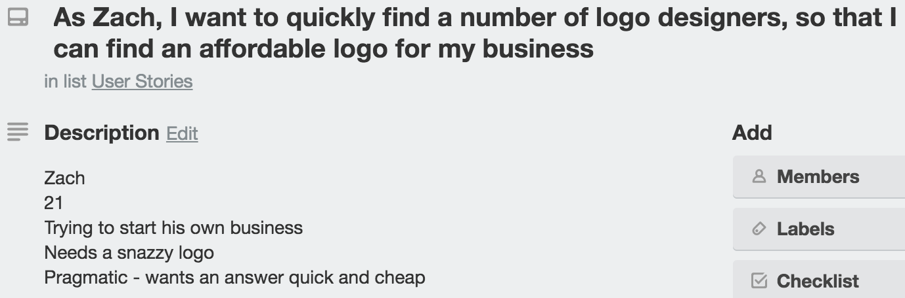
- What I struggled with was the perspective of the artist, so I asked my partner what kind of 'struggles' she has as an artist, to get an idea
- 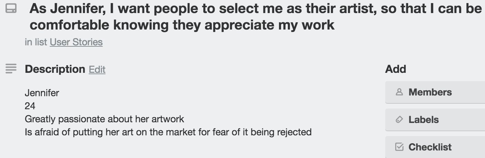
- 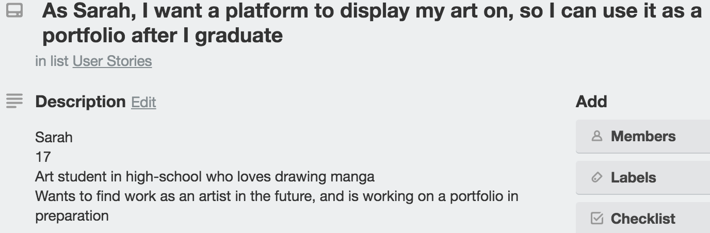

## Design

### My figma for the app: https://www.figma.com/file/PGyq9MdjaHLUe2MV9QSwUmFg/Artistree

### Themes
- The app is designed for buying and selling art, but is also designed to connect people. Ultimately, 'connecting people' is the service this app provides.
- With this in mind, I decided to build the theme by combining art with something that represents interconnectedness
- The theme I chose combines art and trees. I wanted to represent this by making paint-splatter-like SVGs that look like leaves - in the logo for example:
- 

### Fonts
- Ruthie was chosen for the headings, as I wanted something beautiful with a creative 'flair' to it. The headings are also designed to be used with the colour splashes, and this meant that something 'hard' or 'sensible' would look out of place
- 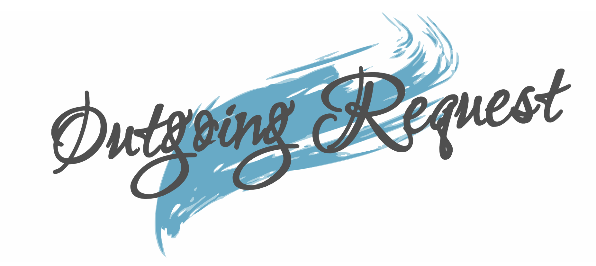
- Rosarivo was chosen as the main text font. I wanted something that is easy to read, but also continues the creative 'flair' - on a smaller scale. I thought that the serifs accomplished this.
- 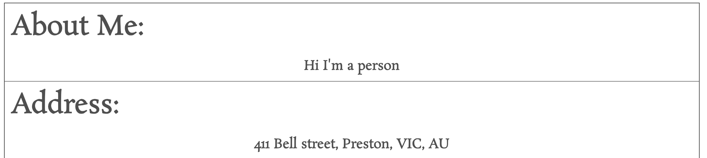

### Colour Scheme
- Because the app will need to display a wide variety of art from many different artists, it was important to leave a lot of the interface white, so as not to interfere with the colour palettes of individual pictures
- So instead of having colours appearing constantly throughout the app, I decided to have splashes of colour in places without any pictures
    - An example of pictures being displayed - with minimal colour
    - 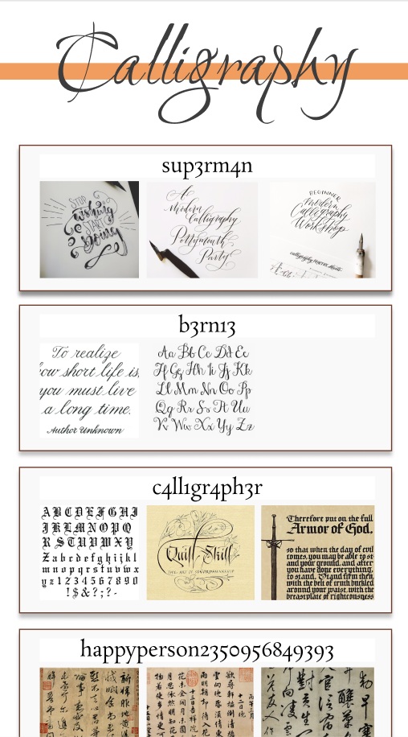
    - An example of colour 'splashes' from figma:
    - 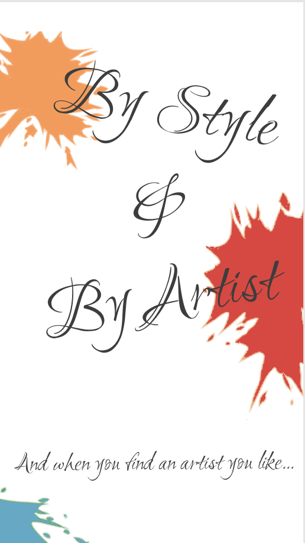
- The app has four different general areas (portfolio, browse by style, browse by artist, and requests), and I decided that each of these needed to have a distinct colour to influence the user in a different way. My thoughts on these colour choices can be seen in the following picture:
- 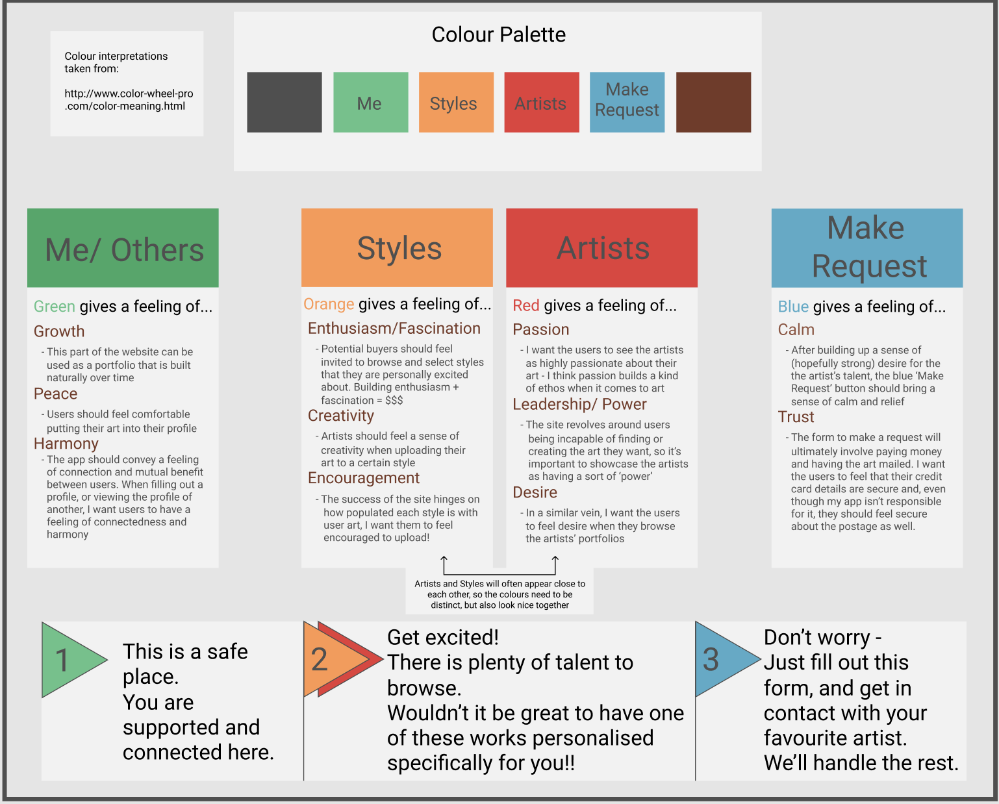

## User Flow
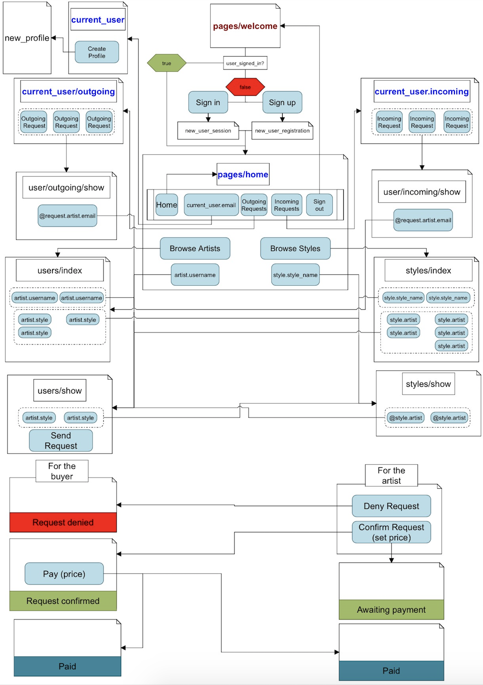
- users are encouraged upon signing up to create a profile, then browse artists and, after finding an artist they like, sending a request
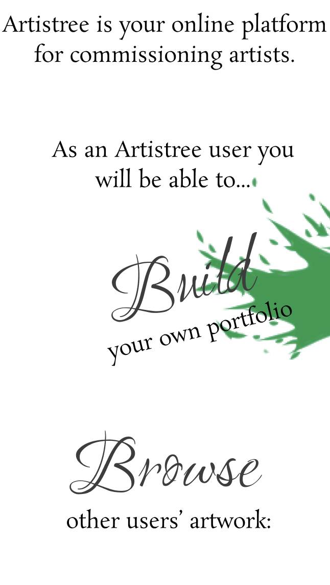

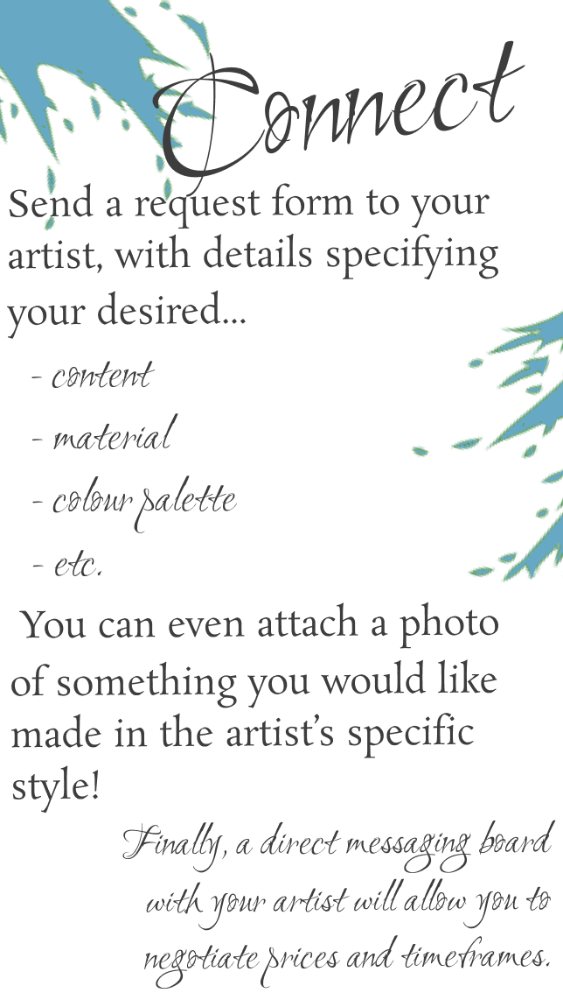
## Database - Tables & Associations
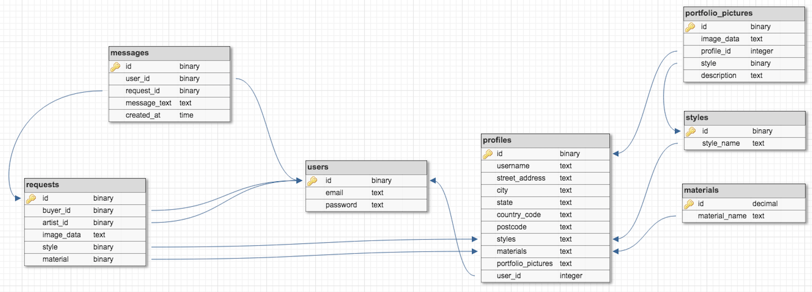
### users
- a simple devise generated table with email and password
- each user can 'have':
    - a profile
    - portfolio pictures (through profile)
    - styles (through profile)
    - requests (incoming or outgoing)
    - messages (which also belong to a request)
### profiles
- keeps track of the user's:
    - address
    - portfolio pictures
    - styles
### styles
- stores styles by name, nothing else
### requests
- each request takes two users: one takes the role of 'buyer', the other 'artist'
    - in order to accomplish this, the following associations were necessary:
        ```
        # profile.rb

        class Request < ApplicationRecord
            belongs_to :buyer, class_name: 'User'
            belongs_to :artist, class_name: 'User'
        end
        ```
        ```
        # user.rb

        class User < ApplicationRecord
            has_many :incoming_requests, class_name: 'Request', foreign_key: 'artist_id'
            has_many :outgoing_requests, class_name: 'Request', foreign_key: 'buyer_id' 
        end  
        ```
    - it was also necessary to remove   foreign_id: :true    for :buyer and :artist from the migration file
### messages
- stores individual messages that link one user_id with one request_id


## Problems Encountered
- ### CSS
- margins being overwridden (margins that I set are ignored)
    - solution: used .divider class with height: 100px to create space
- ### Controllers
- Making the artist(who receives the outgoing message) to be automatically assigned to the new_request form 
    - solution: I ended up putting the link to the 'Send a Request' button on the users/show page
    - this link adds the artist to the params when clicked:
    ```
    <p class="btn btn-blue"><%= link_to "Send a Request", new_request_path(request.parameters.merge({artist: @user})) %></p>
    ```
    - the artist is then instantiated again in the new action for RequestsController:
    ```
    @artist = User.find(params[:artist])
    ```
    - and submitted in the form with a hidden_field:
    ```
    <%= f.hidden_field(:artist_id, value: @artist.id) %>
    ```
    - finally, the artist is assigned to the request in the create method, in the RequestsController:
    ```
    @request.artist = User.find(params[:request][:artist_id])
    ```

    ### attributes to columns
    - adding numerous styles to a profile's 'styles' attribute
        - solution: 
        - Adding a collection_check_boxes field to the edit profiles form:
        ```
        <%= form.collection_check_boxes :style_ids, Style.all, :id, :style_name %>
        ```
        - permitting :style_ids as a params key for an empty array:
        ```
        params.require(:profile).permit(:username, :street_address, :city, :state, :country_code, :postcode, :about, :user_id, :style_ids => [])
        ```